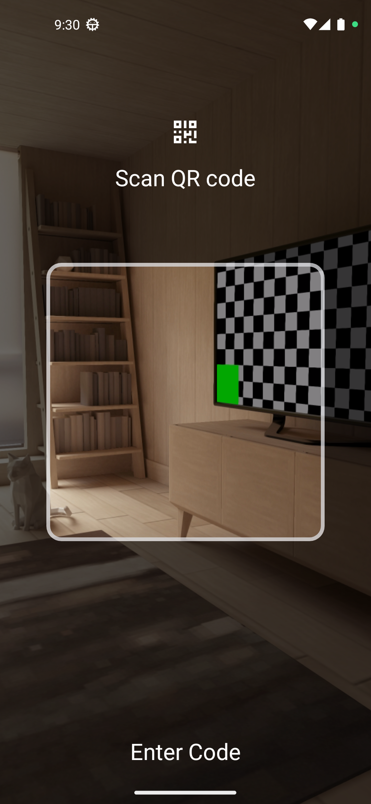
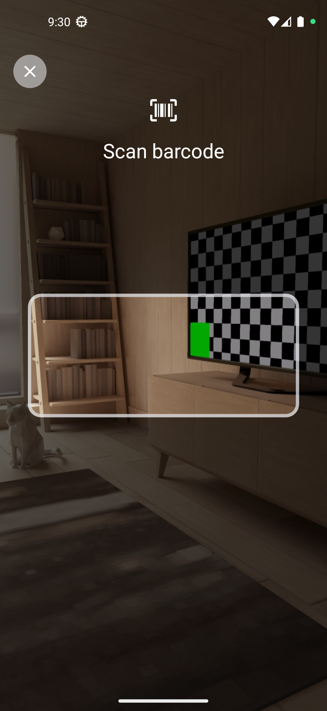

# Easy Scanner
Anroid library handling Qr Scanning and barcode scanner in easy and fast way 

- Easy API for launching the QR scanner and receiving results by using the new Activity Result API.
- Modern design, edge-to-edge scanning view with multilingual user hint.
- Android Jetpack CameraX for communicating with the camera and showing the preview.
- ML Kit Vision API for best, fully on-device barcode recognition and decoding.


Qr Scanner                                                |  BarCode Scanner            
:-------------------------------------------------------: |:-------------------------:
  |   


# Download
--------
Gradle:

```gradle
repositories {
   maven { url 'https://jitpack.io' }
}

build.gradle (app)

dependencies {
	implementation 'com.github.BasemNasr:EasyScanner:v1.0.0'
}
```


# Easy Way To Using Library
```kotlin
private val scanQrCode = registerForActivityResult(ScanCustomCode(), ::onScanResult)
// QR SCANNER
scanQrCode.launch(
     ScannerConfig.build {
          setShowTextAction(true, getString(R.string.or_enter_code_number))
                setShowCloseButton(true)
		//you can put other configs here 
         }
)

// other config
setOverlayStringRes(@StringRes stringRes: Int)
setOverlayDrawableRes(@DrawableRes drawableRes: Int?)
setHorizontalFrameRatio(ratio: Float)
setHapticSuccessFeedback(enable: Boolean)
setShowTorchToggle(enable: Boolean)
setUseFrontCamera(enable: Boolean)
setShowTextAction(enable: Boolean, text: String) // bottom text

//Bar Code Formate
selectedBarcodeFormat = BarcodeFormat.FORMAT_ALL_FORMATS
setBarcodeFormats(listOf(selectedBarcodeFormat)) // set interested barcode formats

```

 
#### Jetpack Compose
Use the `rememberLauncherForActivityResult()` API to register the `ScanQRCode()` ActivityResultContract together with a callback in your composable:
```kotlin
@Composable
fun GetQRCodeExample() {
    val scanQrCodeLauncher = rememberLauncherForActivityResult(ScanQRCode()) { result ->
        // handle QRResult
    }
    
    Button(onClick = { scanQrCodeLauncher.launch(null) }) {
    …
}
```


Pull requests are the best way to propose changes to the codebase (we use [Github Flow](https://guides.github.com/introduction/flow/index.html)). We actively welcome your pull requests:

1. Fork the repository and create your branch from `master`.
2. If you've added code that should be tested, add tests.
3. If you've changed APIs, update the documentation.
4. Ensure the test suite passes.
5. Make sure your code lints.
6. Issue that pull request!
7. Always add a `README` and/or `requirements.txt` to your added code.

## Report bugs using Github's [issues](https://github.com/BasemNasr/EasyScanner/issues)
We use GitHub issues to track public bugs. Report a bug by opening a new issue it's that easy!

*Great Bug Reports* tend to have:

- A quick summary and/or background
- Steps to reproduce
    - Be specific!
    - Give sample code if you can.
- What you expected would happen
- What actually happens
- Notes (possibly including why you think this might be happening, or stuff you tried that didn't work)

People love thorough bug reports. I'm not even kidding.


